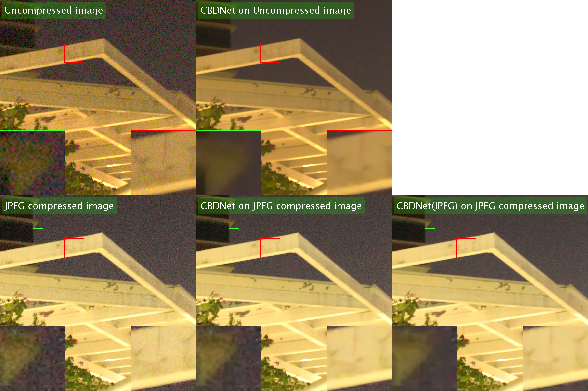

# CBDNet-pytorch
使用了ultras22的虚拟环境


It's an unofficial PyTorch implementation of CBDNet.

We used higher quality real and synthetic datasets for training and achieved better performance on DND.

[CBDNet in MATLAB](https://github.com/GuoShi28/CBDNet)

[CBDNet in Tensorflow](https://github.com/IDKiro/CBDNet-tensorflow)

## Quick Start

Download the dataset and pretrained model from [GoogleDrive](https://drive.google.com/drive/folders/1-e2nPCr_eP1cTDhFFes27Rjj-QXzMk5u?usp=sharing).

Extract the files to `data` folder and `save_model` folder as follow:

```
~/
  data/
    SIDD_train/
      ... (scene id)
    Syn_train/
      ... (id)
    DND/
      images_srgb/
        ... (mat files)
      ... (mat files)
  save_model/
    checkpoint.pth.tar
```
新的训练开始时，如果/mnt/evo1/jiangmingfu/CBDNet-pytorch-master/CBDNet-pytorch-master/save_model/里面有checkpoint.pth.tar，需要把checkpoint.pth.tar删去，要不引发错误

Train the model:
```
没有校准的：
python train.py
有校准的：
python train_calibration.py

```
#使用经过训练的模型进行预测:
Predict using the trained model:

```
python predict.py input_filename output_filename
修改predict.py里面的模型名字
一次test一个图片
其中input_filename是包含路径的图片名，output_filename是包含保存路径的图片名。实际例子命令如下：
python predict.py Test_Image/input/00070.jpg  Test_Image/output/00070t1_uncertainty2000epoch.jpg

MC 蒙特卡洛推理
python predict.py Test_Image/input/sigma-openneuro_01672_00073_t1.jpg Test_Image/output/sigma-openneuro_01672_00073_t1_denoised.jpg

python predict.py Test_Image/input/00071.jpg Test_Image/output/00071mc.jpg

python predict.py Test_Image/input/BraTS2021_00002_00071_t2.jpg  Test_Image/output/brats202100002/BraTS2021_00002_00071_t2_uncertainty50000epoch.jpg


下游任务分割实验(一)（一次测试多个病例，批量处理）：
1.把数据集/mnt/gemlab_data/Medical_image_database/MRI/segmentation/MR_Dataset/8ProstateX/imagesTr/
使用datasetmove2files_Prostate.py
放入每个病例一个文件夹的/mnt/gemlab_data_2/jiang/CBDNet/prostate_origin_8ProstateX_files/里面
2.多个图片批量去噪并把noisy img, denosied img, uncertainty map保存为切片
python predict_uncertainnii_Prostate.py
3.把去噪后的文件转为nii.gz格式
input_dir = "/mnt/gemlab_data_2/jiang/CBDNet/prostate_denoised_nii/calibration_denoised3000epochs"
output_dir = "/mnt/gemlab_data_2/jiang/CBDNet/prostate_denoised_nii/calibration_denoised3000epochsnii"
执行：python  jpgtonii_prostate.py


下游任务分割实验（二）（一次测试多个病例，批量处理）：
python predict_uncertainnii_brats.py
python jpgtonii_brats.py


读入数据这里，batch_size的设置一定要小于子文件夹个数，不然训练时损失函数一直为0,我们子文件夹为1，batchsize也设置为1
'``

#使用一个单独的py脚本train(暂没用):
 CUDA_VISIBLE_DEVICES=0,1,2,3 python mrcbdnetgaijinuncert.py

"观察 GPU 利用率:watch -n 1 nvidia-smi"
## Network Structure


## Realistic Noise Model
Given a clean image `x`, the realistic noise model can be represented as:

)))

=n_s(\\textbf{L})+n_c)

Where `y` is the noisy image, `f(.)` is the CRF function and the irradiance(辐照度) ) , `M(.)` represents the function that convert sRGB image to Bayer image and `DM(.)` represents the demosaicing function.

If considering denosing on compressed images, 

))))

## Result


